# Initial Configuration

## Installing Active Directory Domain Services

Firstly the Windows Server will be used as a Domain Controller so I installed Active Directory Domain Services from the **Add roles and features** under the Manage section on the Server Manager Toolbar.

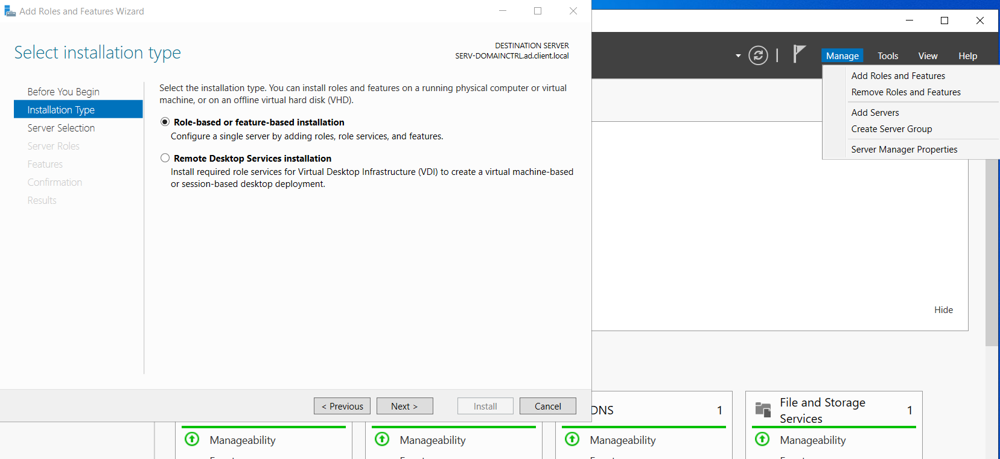

From there I followed instructions and installed the Active Directory Services.
Since the features are installed I need to promote my server to a Domain Controller for which I was already prompted.

To do this I first have to create a new AD forest and a root domain name:
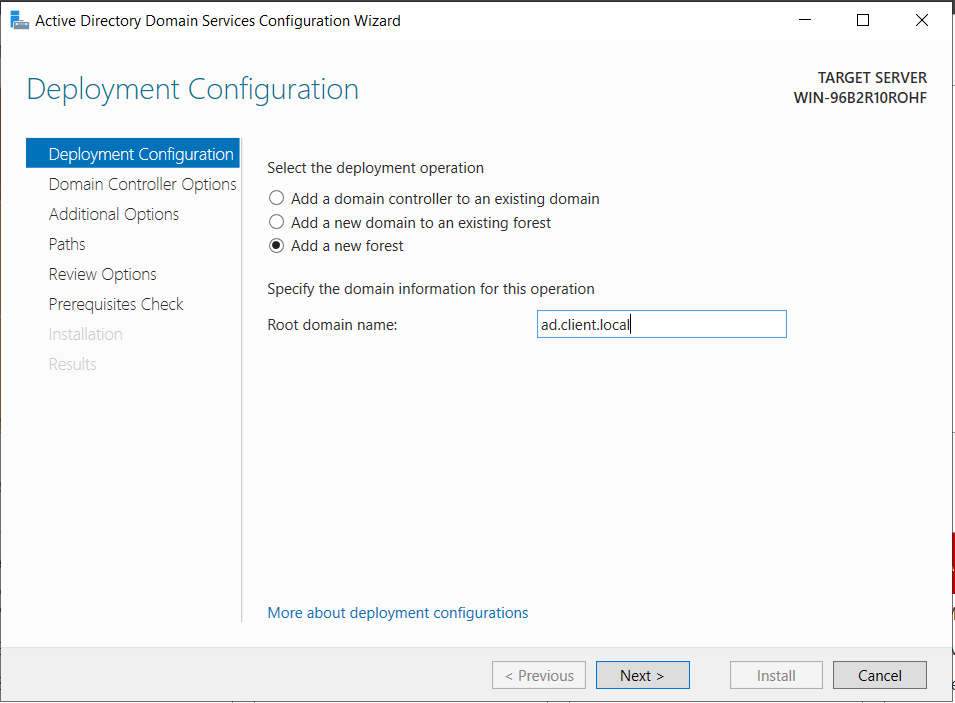

After creating a new forest and domain I was prompted for the DSRM password or Directory Services Recovery Mode password followed by the NetBIOS domain name.

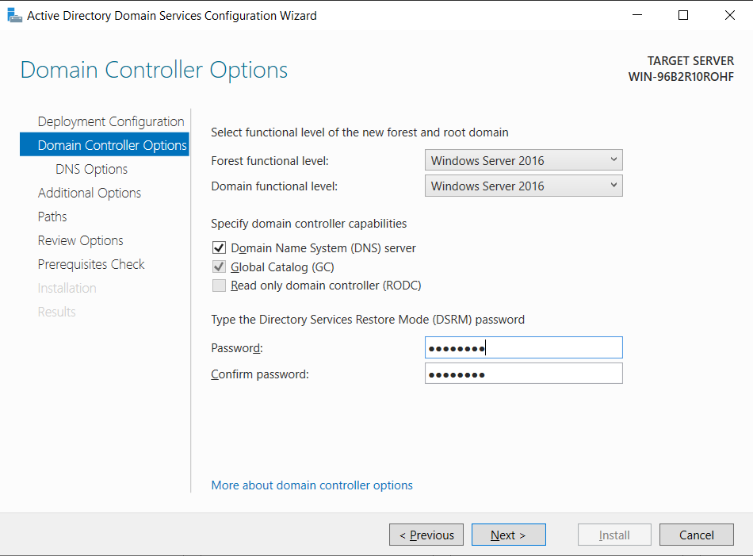
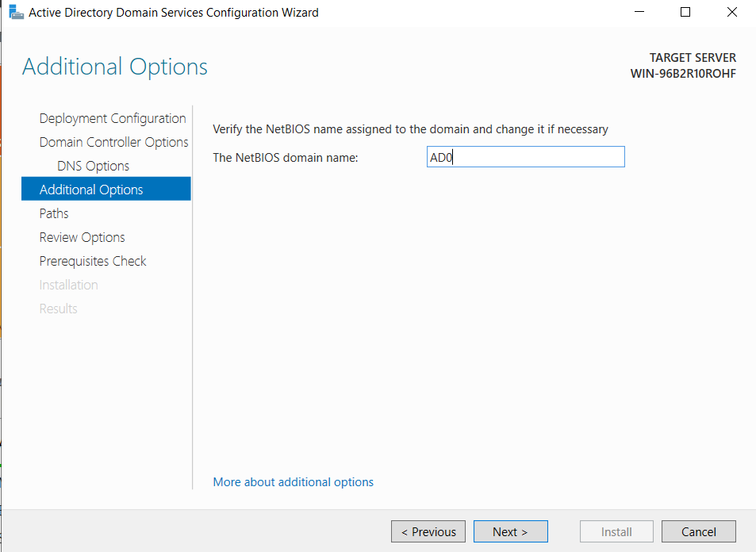

Now I just pressed Next and Install after the Prerequisite check and waited for the installation to finish.

## Installing Active Directory Certificate Services

After Domain Services, I needed to install Certificate Services to add new Users and Computers.
Again from the Manage section on the Server Manager Toolbar I selected **Add roles and features** and selected **Active Directory Certificate Services**.
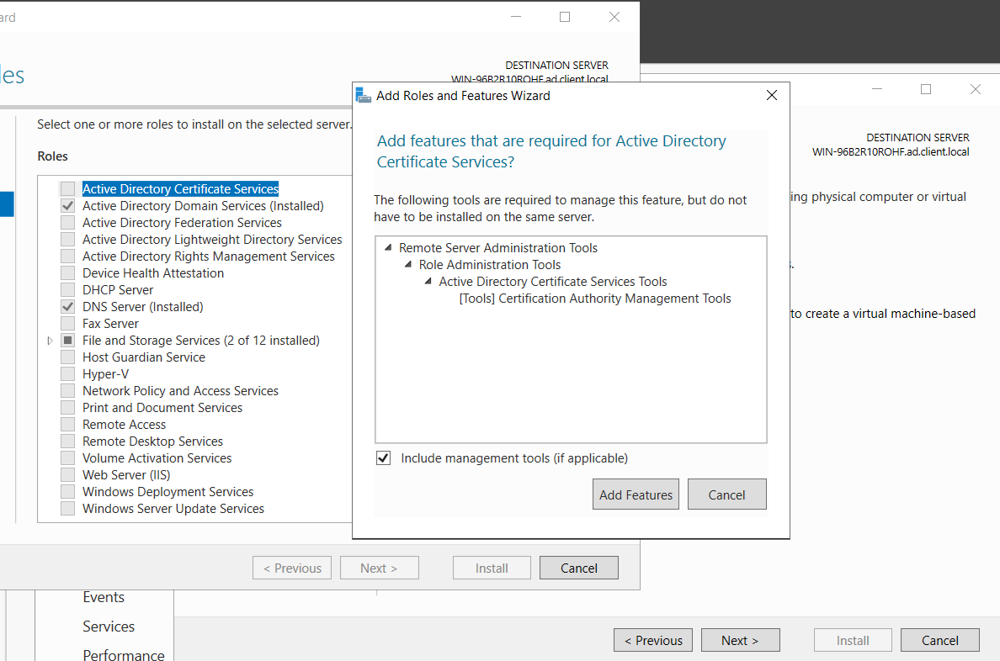

I just followed instructions leaving default values and waited for the install to finish and prompt me for Post-install configuration.

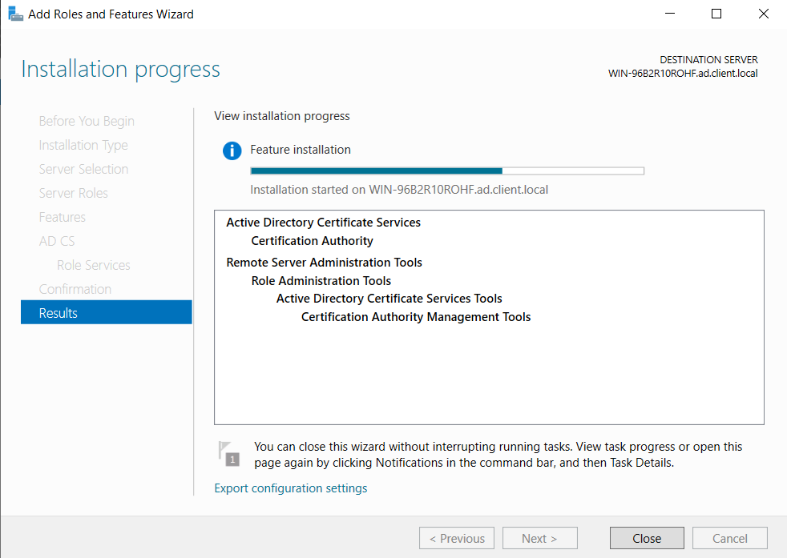

To begin configuring Certificate Services first I needed to specify Administrator user that will be used to configure.

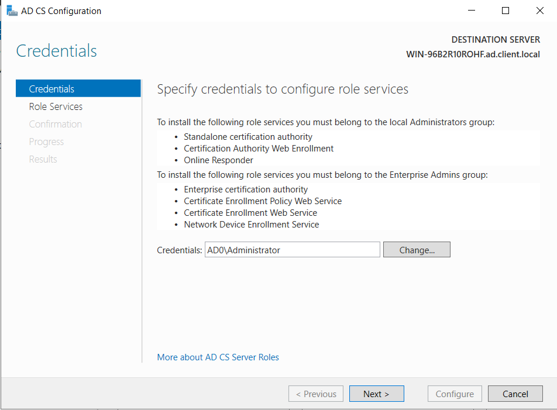

Next, specify the type of the setup which in my case is Standalone CA.

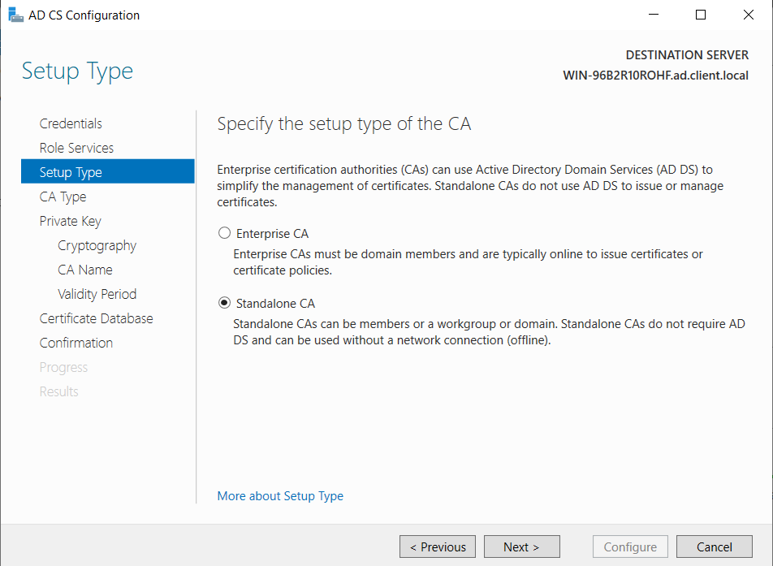

And for the last thing that I setup is validity period which I set to 99 years, just for simplicity reasons since this is a lab.

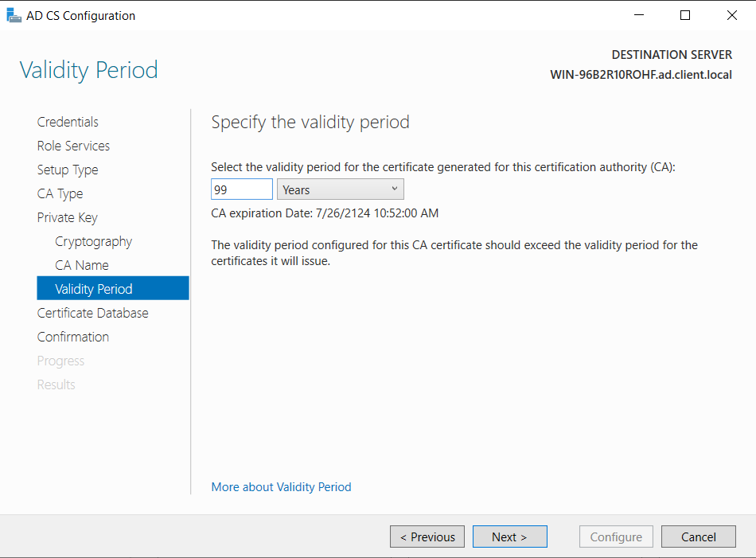

Other settings I leave the default and finish installing.

## Adding a new Active Directory user

To add a new user into the domain, I used the **Active Directory Users and Computers** application from the Tools section on the Server Manager Toolbar.

To add a new user, select the Users directory in the main domain directory, and using the right click menu select add a new user.

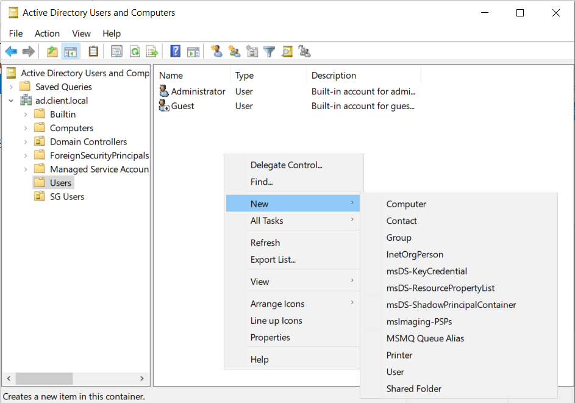

In the new window add the new user information, logon names and go next.

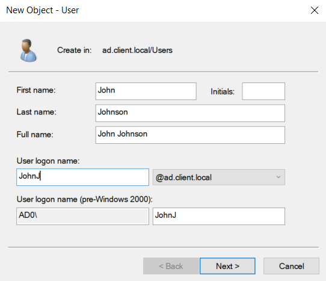

The last thing to do is set a new password and finish setting up the user, I also unchecked the "User must change password at next logon" setting, again for simplicity reasons.

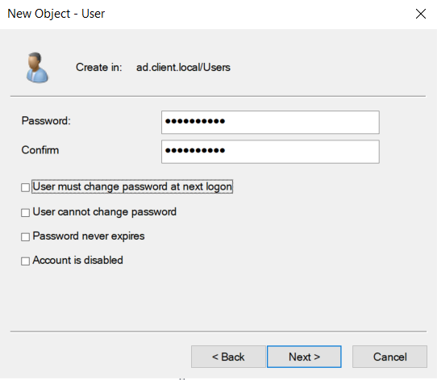

## Adding a workstation to the domain

To add a new workstation to the domain I used **Access work or school** from the Start menu.

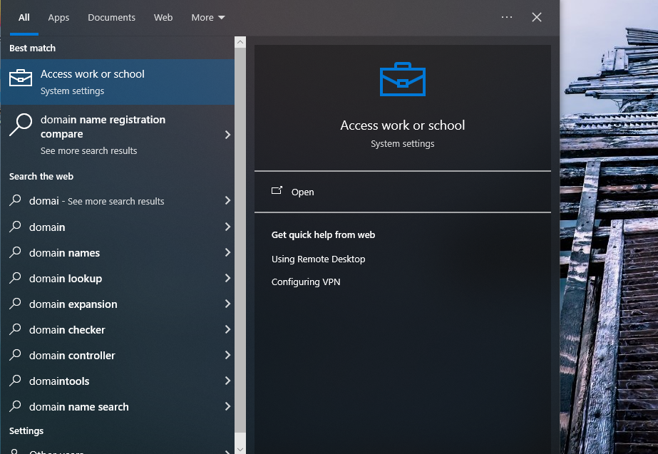

This will open a new menu with a Connect button. This will in turn open up another menu where the configuration will take place.

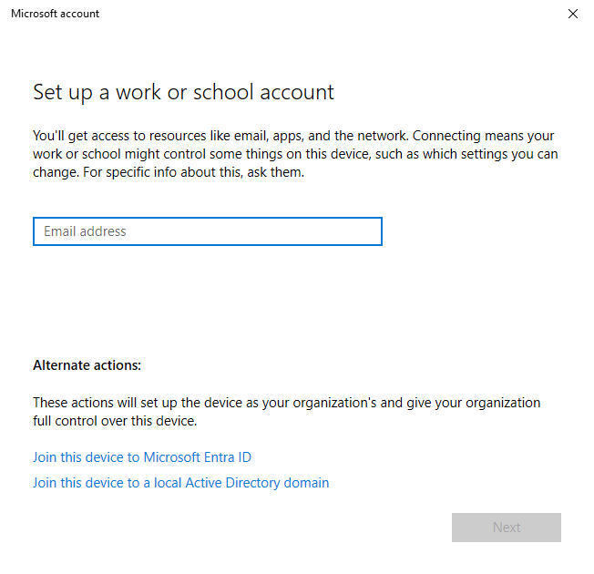

Here, I selected the option to add the PC to a local Active Directory domain, which then in turn prompted for the domain name.

> Note:
> If the domain name cannot be recognized, check your PCs DNS settings

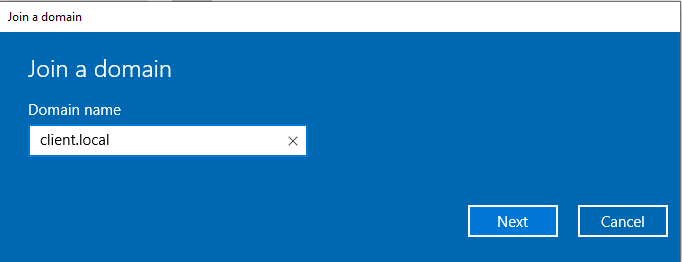

After entering the domain name, a window will popup prompting for credentials.

I entered the Administrator credentials and added this machine to the `client.local` AD domain.

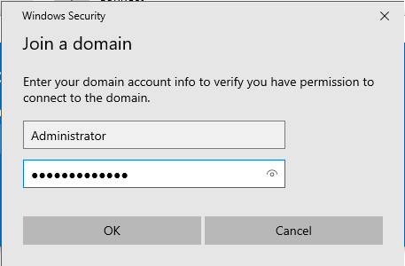