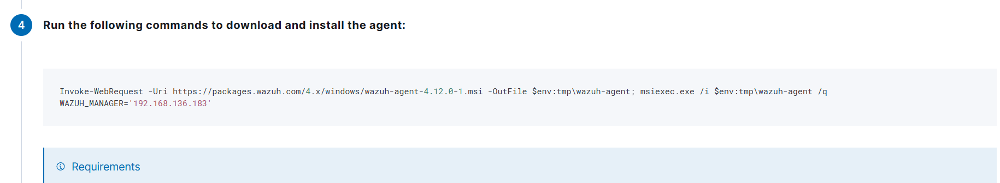
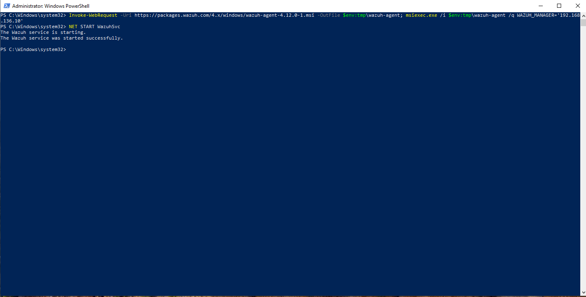
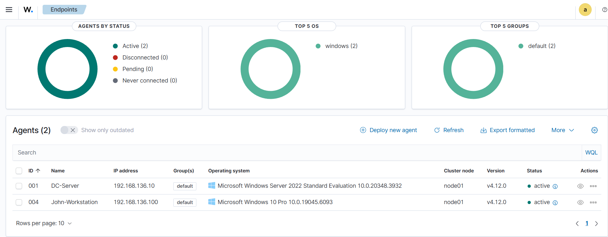
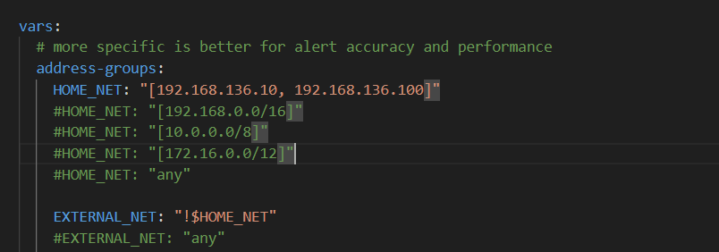
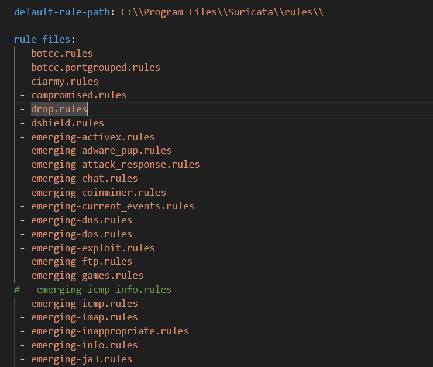
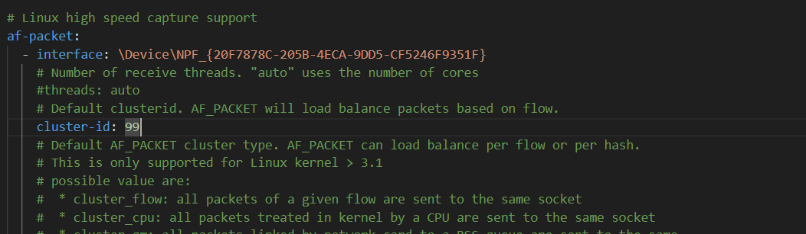

# SIEM Configuration

## Ubuntu Server Configuration
First I made sure to update and fully upgrade my server before continuing.

After the updates were done I looked at the Wazuh documentation and found the one-liner install command for linux operating systems:
```
curl -sO https://packages.wazuh.com/4.12/wazuh-install.sh && sudo bash ./wazuh-install.sh -a
```
- This will download and run the Wazuh installation assistant which will install and output important data like the admin credentials

## Agent Deployment

To deploy agents for collecting logs and providing alerts in Wazuh it is simple as following the instructions on screen.

Wazuh dashboard provides all the instructions step by step.


*Command that Wazuh offers for agent deployment, just copy paste after setting up the server IP and Agent name and platform*


*Use an Administrator Powershell, and after installing start the service with `NET START WazuhSvc`*

Looking on Wazuh dashboard overview both agents are up and running.



## Configuring Suricata IDS

For the network detection and alerting I am going to use Suricata and integrate it into the Wazuh Agent that sends data to the SIEM Server.

To do this first install Npcap, and Suricata on both Windows machines.

Configuring Suricata is pretty straight forward, if you want more rules you can download all [Emerging Threats](https://rules.emergingthreats.net/open/) rules from their website put them in the rules/ directory inside Suricata install directory, located usually in `C:\Program Files\Suricata\`.

After downloading rules open suricata.yaml and there I needed to edit 3 things:


*1. The HOME_NET variable representing the network that is monitored*


*2. The default rules directory and specific rules to be loaded:*


*3. And the interface which will be used for listening.*\
On Windows it is a bit specific, suricata expects the interface ID which can be obtained by simply running:
`suricata.exe -c suricata.yaml -i <IP_ADDRESS>`
- The IP_ADDRESS here represents the address of the interface on which Suricata will run

This in return will start Suricata and show the interface ID for that interface behind the IP address.\
Usually something like:
`\Device\NPF_{20F7878C-205B-4ECA-9DD5-CF5246F9351F}`